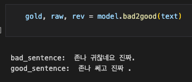
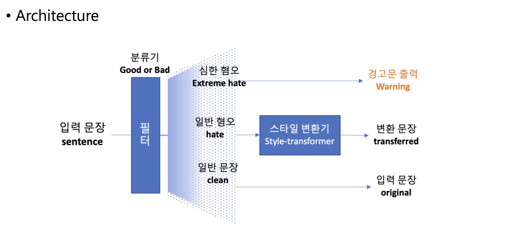
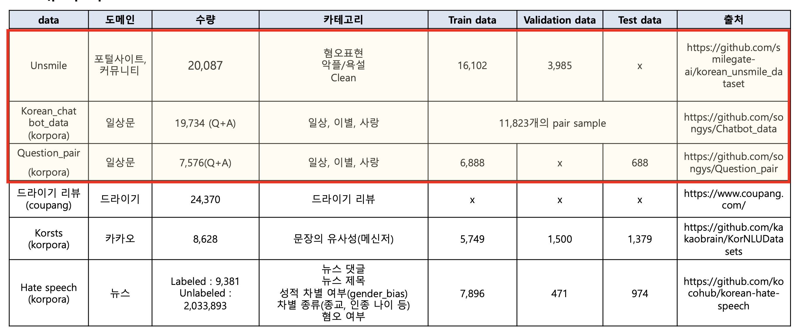
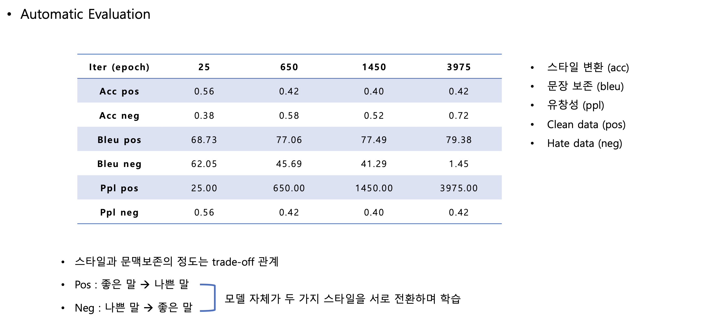

# bad2good_korean
A toy project for transforming toxic or offensive Korean sentences into polite and positive expressions using style transfer.
This project rewrites toxic or hateful Korean sentences into more respectful and kind expressions.

# Architecture

# Dataset

# Evalutaion

