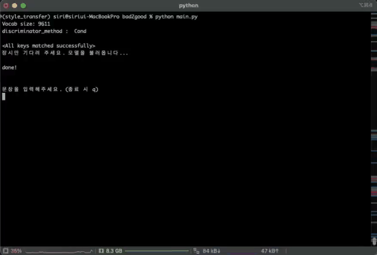
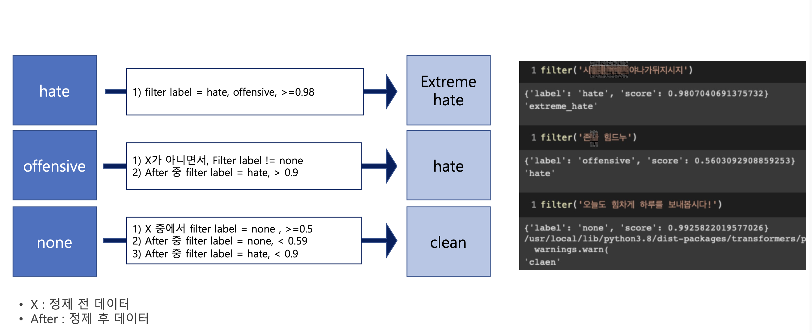

# bad2good_korean
A toy project for transforming toxic or offensive Korean sentences into polite and positive expressions using style transfer.
This project rewrites toxic or hateful Korean sentences into more respectful and kind expressions.

본 프로젝트의 목표는 SNS를 비롯한 온라인 비속어, 욕설에 대한 순화로 올바른 온라인 문화 형성 및 환경 구축을 위한 첫 걸음으로써 나쁜 말을 순화할 수 있는 어플리케이션을 제작하는 것입니다.
나쁜 말 순화는 비속어 및 은어(예: 닥x, 이 또xx xx야(욕설), 이거 ㅅㅌㅊ네(은어)), 정치적, 성별, 세대 갈등을 조장, 사회적 문제를 야기하는 뉴스 기사의 악성 댓글(예: 이거 완전 좌빨이네(정치적), 한남, 한녀(성별), 틀x이네(세대))과 같은 텍스트들을 삭제, 대체, 원복 등을 통해 적절한 말로 변환하는 것을 목표로 했습니다. 
씨x’와 같은 욕설은 삭제하고‘X나’, ‘졸라’ 와 같은 비속어는 ‘너무’, ‘굉장히’로 ‘개슬림’과 같은 단어는 ‘무슬림’으로 원복시킵니다.

----

The goal of this project is to create an application that promotes a healthier online culture by transforming offensive and toxic language—commonly found on social media and online communities—into more respectful and appropriate expressions.

Specifically, this project involved three main steps:
  1. Collecting and analyzing Korean slang, hate speech, and abusive language from online platforms.
  2. Applying a deep learning model (Text Style Transformer) to rewrite toxic or hateful sentences into more polite, socially acceptable language.
  3. Integrating a hate speech classifier to filter out inputs that are too aggressively offensive or nonsensical for meaningful transformation.

The system targets a wide range of expressions, including:
  - Slang and obscenities (e.g., “씨x” → [deleted], “X나” → “very”)
  - Offensive abbreviations (e.g., “개슬림” → “무슬림”)
  - Socially divisive terms related to politics, gender, or age (e.g., “좌빨”, “한남”, “틀x이”)
The final output aims to either delete, replace, or restore such terms depending on their intent and level of offensiveness.

# Architecture
## Main module
The main module of this project is a style transformer, a text style transfer model that rewrites sentences containing slang or hate speech into more neutral, standard expressions. Based on the Transformer architecture, the model preserves the original content while changing the stylistic attributes of the text.

## Sub module
As a sub-module, a hate speech filter is implemented using the KcELECTRA-hate classifier, which was pretrained on SmilegateAI's korean_unsmile_dataset. The dataset defines hate speech as hostile or mocking language directed at specific social groups. KcELECTRA, trained on user comments and replies from Korean online platforms, is particularly well-suited for this task.

# Dataset

# Evalutaion

